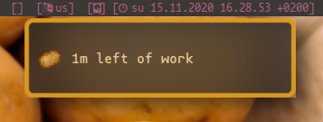
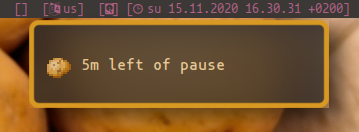
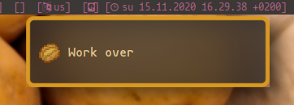
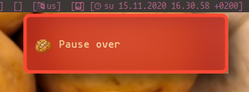

# potato-notify
A pomodoro timer with notifications.

## Screenshots
(using `dunst`)
#### Work notification

#### Break notification

#### Work complete notification

#### Berak complete notification


## Help
``` 
usage: potato [-s] [-m] [-w m] [-b m] [-h]
    -s: simple output. Intended for use in scripts
        When enabled, potato outputs one line for each minute, and doesn't print the bell character
        (ascii 007)

    -m: mute -- don't play sounds when work/break is over
    -w m: let work periods last m minutes (default is 25)
    -b m: let break periods last m minutes (default is 5)
    -h: print this message
```

## Credits
----
fork from `Bladtman242/potato`

Notification sound (notification.wav, originally
zapsplat\_mobile\_phone\_notification\_003.mp3 decoded and saved as wav with
mpg123)
obtained from [zapsplat.com](https://www.zapsplat.com/) under Creative Commons
CC0.
